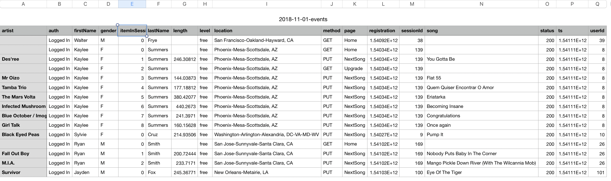

## Project: Data Modeling with Apache Cassandra
---
### 1. Introduction
---
A startup called Sparkify wants to analyze the data they've been collecting
on songs and user activity on their new music streaming app. They'd like a data engineer to create an Apache Cassandra database which can create queries on song play data to answer the questions they're interested in.
In this project, I'll apply data modeling by creating tables in Apache Cassandra to run queries. Specifically, I'll build a ETL pipeline that transfers data from a set of CSV files within a directory to create a streamlined CSV file to model and insert data into Apache Cassandra tables.

### 2. Project Datasets
---
**event_data**
The dataset contains a bunch of CSV files, in which song-play data history are recorded  

### 3. Data Modeling
---
My goal is to answer following three questions:

| 1 | Find the artist, song title and song's length in the music app history that was heard during sessionId = 338, and itemInSession |
|---|---------------------------------------------------------------------------------------------------------------------------------|
| 2 | Find the name of artist, song (sorted by itemInSession) and user (first and last name) for userid = 10, sessionId = 182 |
| 3 | Find every user name (first and last) in my music app history who listened to the song 'All Hands Against His Own' |

 For my goal, I'll apply data modeling in following steps:
 1. **Build a ETL pipeline**. Creating list of FilePaths to process original event CSV data files and processing the files to create the data file CSV that will be used for Apache Cassandra tables.
 2. **Design tables.** Create tables that satisfy the queries
 requirement and insert data into tables from event_data accordingly.
 3. **Test result.** By running the `SELECT` queries after finishing the insertion and return the result in DataFrame format.

 ### 4. Usage
 ---
 - `event_data`  The original dataset contains all the CSV files 
 - `Project_1B_ Project_Template.ipynb` Source code for building ETL pipeline, Cassandra data modeling part and queries result for answering three questions. To run this file, make sure jupyter notebook and all the necessary packages installed.
 - `event_datafile_new.csv` A data CSV file after pre-processing from original dataset and be ready for table insertion.
