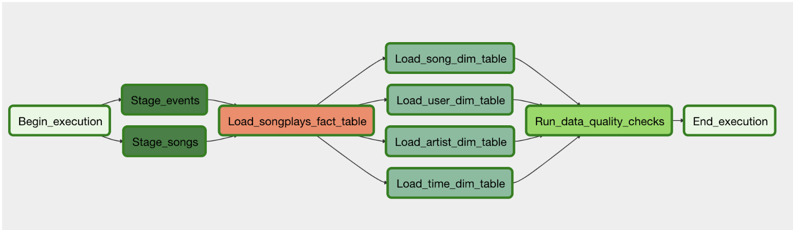

# Project: Data Pipelines with Airflow
### 1. Introduction

A music streaming company, Sparkify, has decided to implement Apache Airflow as their automation tool to monitor their data warehouse ETL pipelines.

In this project, I'll create high grade data pipelines that are dynamic and built from reusable tasks, which can be monitored, and allow easy backfills by using Apache Airflow.

### 2.Apache Airflow
Airflow is a platform to programmatically author, schedule and monitor workflows. Use airflow to author workflows as directed acyclic graphs (DAGs) of tasks.
Here is the shown of DAGs for this project:

### 3.Data sets
Two datasets resides in Amazon S3.  Here are the s3 links for each: 
`Log data: s3://udacity-dend/log_data`  
`Song data: s3://udacity-dend/song_data`

### 4. How to use
For how to access Airflow UI and running its tasks, check Airflow official turoial: https://airflow.apache.org/start.html  
`create_tables.sql` - The sql queries to create all of the original tables.  
`udac_example_dag.py` - The DAG file in Airflow to run the ETL pipeline process 
`stage_redshift.py` - Operator in Airflow to read source data from Amazon S3 and stage them into Redshift staging tables.  
`load_fact.py` - Operator in Airflow to load the fact table in Redshift.  
`load_dimension.py` - Operator in Airflow to read from staging tables and load the dimension tables in Redshift  
`data_quality.py` - Operator in Airflow for data quality checking
